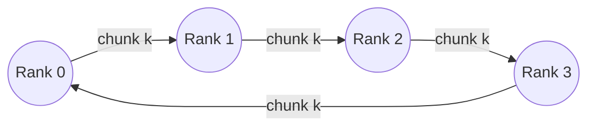

# micro-ccl

A minimal MPI-style collective communication library built directly on
`libibverbs` (RDMA verbs) -- no MPI, no UCX, no libfabric underneath. It
implements point-to-point send/recv over reliable-connected (RC) queue
pairs, broadcast, allgather, and two allreduce algorithms (ring and
recursive-doubling), plus a benchmark harness that runs the same sweep
against OpenMPI's `MPI_Allreduce` for comparison.

This is a portfolio/learning project, not a production CCL. It exists to
demonstrate, end to end and defensibly, how collectives are actually built
on top of raw RDMA verbs -- connection setup, zero-copy data movement, and
the two classic allreduce algorithms' very different latency/bandwidth
tradeoffs.

## What this deliberately does not do

- **No UD/unreliable transport, no multicast.** RC only -- see
  [Limitations](#limitations).
- **No fault tolerance.** A dead rank or dropped connection is a fatal
  error, not something the library recovers from.
- **No GPU-Direct RDMA.** Buffers are host memory; there is no
  GPU-to-NIC-direct path.
- **No dynamic process management.** World size and every rank's address
  are fixed at launch, exchanged once via the TCP bootstrap.
- **No non-power-of-two recursive doubling.** The "extra ranks" technique
  real MPI implementations use to generalize recursive doubling to
  arbitrary P is not implemented; see the algorithm's own header comment.
- **Not tuned or validated at cluster scale.** Developed and tested against
  a 2-4 node Soft-RoCE setup, not real InfiniBand hardware or large P.

## Architecture

```
include/micro_ccl/
  verbs/            RAII wrappers: Device, ProtectionDomain, MemoryRegion,
                     CompletionQueue, QueuePair -- raw ibv_* handles never
                     escape this layer
  bootstrap.hpp      TCP out-of-band rendezvous (QP info exchange only,
                     fully separate from the RDMA data path)
  transport.hpp       two-sided send/recv over an established RC QueuePair
  communicator.hpp    full-mesh multi-rank connection setup on top of
                     bootstrap + verbs
  collectives/        reduce_ops, chunking, broadcast, allgather,
                     allreduce_ring, allreduce_recursive_doubling
examples/pingpong.cc  two-rank correctness check: one QP, echoed messages
bench/                benchmark harness + OpenMPI comparison binary
test/                 unit tests (pure functions) + RDMA integration tests
```

Each layer only depends on the one below it: collectives never touch
`ibv_*` directly, transport never touches sockets, bootstrap never touches
a QP. See each header's own comments for the reasoning behind individual
design choices (RAII patterns, move semantics, why RC over UD, etc.) --
they're written to be read, not just referenced.

## Ring allreduce data flow

With P ranks, the buffer is split into P chunks. Reduce-scatter (P-1 steps)
passes each chunk once around the ring, each hop adding one more rank's
contribution; after P-1 steps every rank holds one chunk's *complete*
reduction. Allgather (another P-1 steps) then circulates those completed
chunks the rest of the way around so every rank ends up with all P chunks.



Every rank only ever talks to its two ring neighbors, and every step moves
exactly `data_size / P` bytes regardless of P -- this is what makes ring
bandwidth-optimal (see [`allreduce_ring.hpp`](include/micro_ccl/collectives/allreduce_ring.hpp)
for the full reasoning and the exact chunk-index formulas). Worked example,
P=4, reduce-scatter phase, rank 0's perspective:

| step | rank 0 sends chunk | rank 0 receives chunk | reduces into |
|------|--------------------|-----------------------|---------------|
| 0    | 0                  | 3                     | chunk 3       |
| 1    | 3                  | 2                     | chunk 2       |
| 2    | 2                  | 1                     | chunk 1       |

After step 2, rank 0 holds the complete reduction of chunk 1 -- every other
rank simultaneously finishes a different chunk. The allgather phase then
forwards those completed chunks around the same ring, one more hop each
step, writing straight into their final position in the buffer (no
intermediate copy: the incoming DMA lands exactly where the result needs
to live).

## Setup

Full instructions (packages, bringing up `rdma_rxe`, verifying with
`ibv_devinfo`/`rping`): [`docs/setup.md`](docs/setup.md). Short version, on
each of 2+ Ubuntu 24.04 VMs on the same network:

```bash
sudo apt update
sudo apt install -y build-essential cmake git \
    libibverbs-dev librdmacm-dev rdma-core ibverbs-utils catch2
sudo modprobe rdma_rxe
sudo rdma link add rxe0 type rxe netdev eth0   # replace eth0 with your NIC
ibv_devinfo   # confirm PORT_ACTIVE, link_layer: Ethernet
```

## Build

```bash
cmake -S . -B build -DCMAKE_BUILD_TYPE=RelWithDebInfo
cmake --build build -j
ctest --test-dir build                 # unit tests run anywhere;
                                         # integration tests need the RDMA
                                         # device set up above
```

## Running

Pingpong (foundational two-rank correctness check), one command per VM:

```bash
# VM-A
./build/examples/pingpong --rank 0 --world-size 2 --root-host <VM-A-ip> --root-port 20200
# VM-B
./build/examples/pingpong --rank 1 --world-size 2 --root-host <VM-A-ip> --root-port 20200
```

Benchmark sweep, same pattern (`--rank`/`--root-host` per process, one
process per rank, `--world-size` matching however many you launch):

```bash
./build/bench/bench_allreduce --rank 0 --world-size 4 --root-host <VM-A-ip> \
    --algo both --dtype float32 --op sum --csv-out ring_vs_recdouble.csv
```

OpenMPI comparison mode (only built if `libopenmpi-dev`/`openmpi-bin` are
installed):

```bash
mpirun -np 4 --host <VM-A-ip>,<VM-B-ip> ./build/bench/bench_mpi_allreduce \
    --dtype float32 --op sum --csv-out openmpi.csv
```

Then plot both together:

```bash
python3 scripts/plot_results.py ring_vs_recdouble.csv openmpi.csv -o plots/
```

## Benchmark results

**Not yet measured on real hardware** -- this project was built and
compile-checked in an environment with no RDMA device available (see
`docs/setup.md`'s Soft-RoCE requirement); the commands above are what
produces the actual numbers once run on the 2+ VM Soft-RoCE setup this
project targets. Filling this section in with real `ring_vs_recdouble.csv`
+ `openmpi.csv` output and the generated plots is the last step before
calling the project done -- see the repository's issue/TODO for that run.

**What the sweep should show, and why**, ahead of actually measuring it:

- **Ring wins at large messages.** Its cost is dominated by the bandwidth
  term -- `2*(P-1)/P * data_size` bytes moved per rank, approaching
  `2*data_size` as P grows and never exceeding it -- so as message size
  grows, actual data-transfer time dominates over any fixed per-message
  overhead, and ring's per-rank data volume is the lowest of the two
  algorithms.
- **Recursive doubling wins at small messages.** It only takes `log2(P)`
  sequential round trips versus ring's `2*(P-1)`; at small sizes, each
  round trip's fixed latency (RTT, completion polling, RC handshake
  overhead) dominates over the actual bytes moved, so fewer round trips
  wins even though recursive doubling resends the *entire* buffer at every
  step instead of `1/P` of it.
- **The crossover point** should sit where `2*(P-1)` chunked round trips of
  size `data_size/P` roughly equal `log2(P)` full-size round trips --
  algebraically this shifts right (crossover happens at a larger message
  size) as P grows, since ring's per-step chunk shrinks with P while
  recursive doubling's per-step payload does not.

If a real sweep does *not* show this crossover, the likely causes, in
order of how often they actually turn out to be it: (1) P too small for
recursive doubling's `log2(P)` advantage to be visible against ring's
`2*(P-1)` -- try P=8 or P=16 rather than P=2 or P=4; (2) Soft-RoCE's
software-emulated completion path adding enough fixed per-message latency
that it swamps the algorithmic difference at every size tested; (3) a bug
in one algorithm's chunking that makes it do more work than intended --
the unit tests cover the chunking math itself, but not that ring's phase
boundaries are optimal.

## Limitations

- **RC (reliable connection) transport only.** No UD (unreliable
  datagram), no multicast. RC's reliability guarantees (in-order delivery,
  hardware retransmission) are what make treating collectives as "just
  works" possible without this library reimplementing an ARQ protocol --
  but RC also means a full mesh of `O(P^2)` QPs cluster-wide, which does
  not scale the way a UD-based or hierarchical-tree design would.
- **No fault tolerance.** Bootstrap and every collective assume every rank
  stays up for the process's lifetime; a crashed peer manifests as a hang
  or a completion error, not a recoverable event.
- **No GPU-Direct RDMA.** All buffers are host memory.
- **Star-topology bootstrap.** Rank 0 is a single rendezvous point every
  other rank connects to and relays through -- fine at the small scale this
  project targets, a bottleneck at real cluster scale.
- **Busy-polling completions.** `wait_completion()` spins on `ibv_poll_cq`
  rather than using the event-channel API, trading CPU for latency -- the
  right call for a benchmark-focused library, wrong for a shared/oversub-
  scribed system.
- **Recursive doubling requires power-of-two world size.** See
  [`allreduce_recursive_doubling.hpp`](include/micro_ccl/collectives/allreduce_recursive_doubling.hpp).
- **Tested at small scale (2-4 ranks), on Soft-RoCE, not real InfiniBand or
  RoCE hardware, and not against network-level packet loss or congestion.**
  The verbs/GID-vs-LID code path is written to be hardware-agnostic (see
  `Device`'s comments), but that claim is unverified beyond Soft-RoCE.
- **Flat (not tree) broadcast.** `broadcast()` is O(P) fan-out from root,
  not a binomial tree -- see its header comment for the tradeoff.
